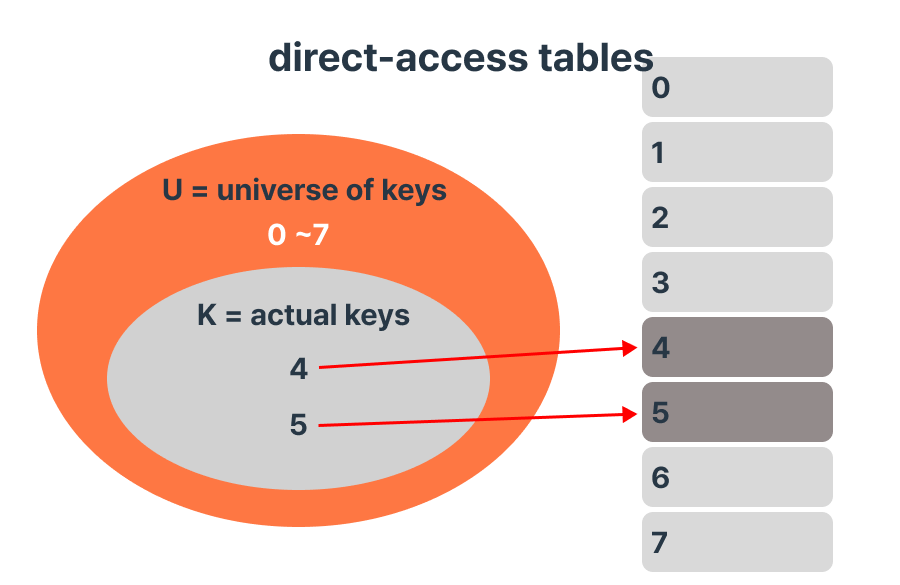
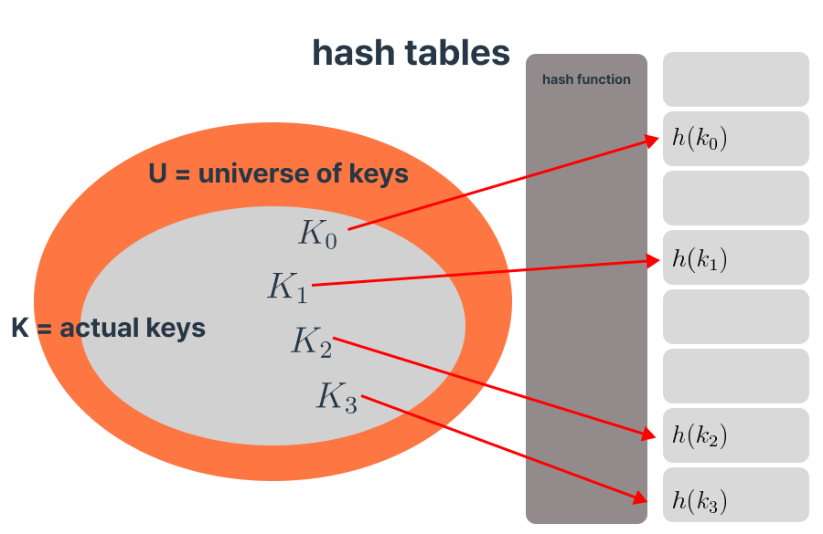

## 0. Contents
- [1. hash table의 definition](#1-hash-table의-definition)
  - [1.0 hash table 사용해야하는 이유? 시간복잡도 비교 측면](#10-hash-table-사용해야하는-이유-시간복잡도-비교-측면)
  - [1.1 direct access table](#11-direct-access-table)
  - [1.2 hash tables](#12-hash-tables)
    - [1.2.1 hash function](#121-hash-function)
    - [1.2.2 hash function의 예시](#122-hash-function의-예시)
      - [1.2.2.1 hashing by division](#1221-hashing-by-division)

## 1. hash table의 definition
> **hash table**은 언어에 따라 hash map, dictionary 등으로 부름 
> - 자료구조 (insert / delete / search)중 search(탐색)에 해당
> - 시간복잡도 평균 = O(1) / worst = O(n)
>   - **dictionary** = generic way to map keys to values
>   - **hash table** = key + value로 구성된 자료구조 (implementation of a dictionary using a hash function)

```python
dictionary = {
    'a':1, 
    'b':9, 
    'c':'nebraska',
    'd':True
}

# insert
dictionary['e']=False

#delete
del dictionary['a']

#search
print(dictionary['c'])
```
### 1.0 hash table 사용해야하는 이유? 시간복잡도 비교 측면 
> - **Array**의 탐색 : O(n)
> - **Binary Search tree**
>    - worst case : O(n)
>    - average case : O(log n)
> - **Balanced binary search tree**(e.g. red-black tree)
>   - worst case : O(log n)
> - **B-tree**
>  
### 1.1 direct access table
> - 배열의 인덱스로 바로 접근하는 방법
> - 배열에서 인덱스를 순서가 아닌, key로 생각하고 key-value쌍을 저장하는 방식
> - key를 바탕으로 배열의 인덱스에 데이터를 저장함
> 
> - **장점** 
>   - 배열의 인덱스에 O(1)로 바로 접근할 수 있다는 것
>   - insert / delete / search의 시간복잡도 모두 O(1)
> - **단점**
>   - 공간 낭비
>   - 위 이미지 예시에서 index[4], index[5]공간을 제외한 나머지는 빈 공간 (공간낭비 ⬆️)

### 1.2 hash table
> - 해싱을 통해 데이터를 저장하는 자료구조
> - 특정 hash function을 사용하여 변환한 index에 key, value를 저장함
> - 실제 값이 저장되는 장소를 bucket이라고 함.
>
> - **장점** 
>   - 
>   - 
> - **단점**
>   - 
>   - 

### 1.2.1 hash function
> **hash function**의 목표 
> - 랜덤 극대화 
> - 충돌 최소화

### 1.2.2 hash function의 예시 
> 1. division
> 2. multiplication
> 3. universal hashing
> 4. dynamic perfect hashing
> 5. static perfect hashing

### 1.2.2.1 hashing by division
```math
h(k) = k \ \text{mod} \ m
```
- m: table 사이즈. 대개 prime number임

---
Ref
- [4분 만에 해시 테이블 이해하기](https://www.youtube.com/watch?v=knV86FlSXJ8)