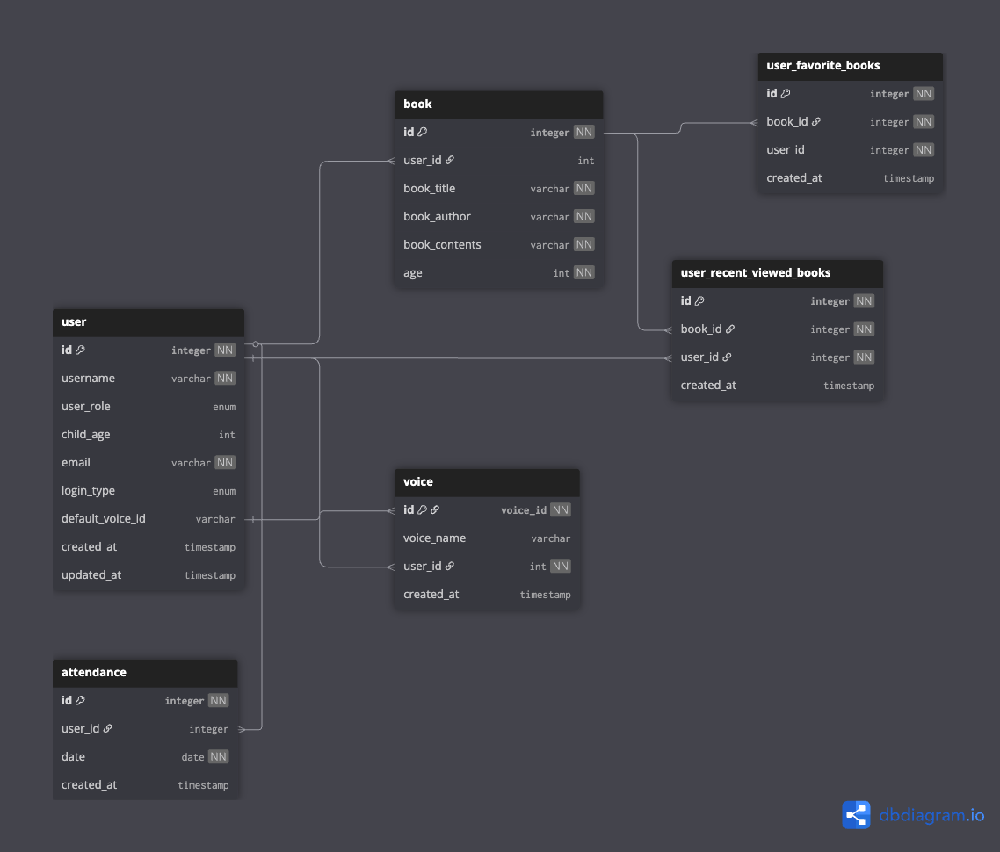

## DBML
> DBML (database markup language) is a simple, readable DSL language designed to define database structures. This page outlines the full syntax documentations of DBML.

```dml

Table user {
  id integer [pk, not null]
  username varchar [not null] 
  user_role enum 
  child_age int
  email varchar [not null]
  login_type enum 
  default_voice_id varchar
  created_at timestamp [default: `now()`]
  updated_at timestamp [default: `now()`]
}

Table voice{
  id voice_id [pk, not null]
  voice_name varchar [default: '기본 음성']
  user_id int [not null]
  created_at timestamp [default: `now()`]
}

Table book{
  id integer [pk, not null]
  user_id int
  book_title varchar [not null]
  book_author varchar [not null]
  book_contents varchar [not null]
  age int [not null]
}

Table user_favorite_books{
  id integer [pk, not null]
  book_id integer [not null]
  user_id integer [not null]
  created_at timestamp [default: `now()`]
}

Table user_recent_viewed_books{
  id integer [pk, not null]
  book_id integer [not null]
  user_id integer [not null]
  created_at timestamp [default: `now()`]
}

Table attendance{
  id integer [pk, not null]
  user_id integer
  date date [not null, unique]
  created_at timestamp [default: `now()`]
}

//user.id 참조 관계
Ref : user.id < voice.user_id
Ref : user.id < book.user_id
Ref : user.id < attendance.user_id
Ref : user.id < user_recent_viewed_books.user_id

//book.id 참조 관계
Ref : book.id < user_favorite_books.book_id
Ref : book.id < user_recent_viewed_books.book_id


Ref : user.default_voice_id < voice.id


```

### ref
- [dbdiagram.io/docs/](https://dbml.dbdiagram.io/docs/)
- [졸프 ERD](https://dbdiagram.io/d/GraduateProject-68649308f413ba3508d03220)