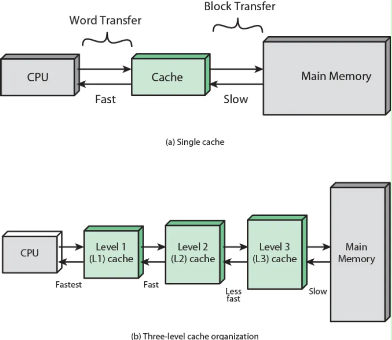

### Contents
- [1. 메모리](#1-메모리)
  - [1.1 메모리 계층 구조](#11-메모리-계층-구조)
  - [1.2 메모리 계층 구조 구분](#12-메모리-계층-구조-구분)

- [2. 캐시(Cache) 메모리](#2-캐시cache-메모리)
  - [2.1 캐싱(Caching)](#21-캐싱caching)
  - [2.2 캐시 메모리](#22-캐시메모리)

- [3. 참조 지역성 원리](#3-참조-지역성-원리)
  - [3.1 참조 지역성 (Locality of Reference)](#31-참조-지역성-locality-of-reference)

## **1. 메모리**

### **1.1 메모리 계층 구조**

> 메모리 계층 구조는 **CPU와 가까운 작은/빠른 저장 장치부터, 멀리 있는 큰/느린 저장 장치까지를 단계적으로 배치한 구조**
> 
- 특징
    - 상위 구조: 속도 빠름, 용량 작음, 비용 비쌈
        - 예: 레지스터, 캐시 메모리
    - 하위 구조: 속도 느림, 용량 큼, 비용 저렴
        - 예: 주기억장치(RAM), 보조기억장치(SSD/HDD), 외부 저장 장치

### **1.2 메모리 계층 구조 구분**

1. 보드 내 메모리 (On-board memory, 휘발성: volatile)
    - **레지스터(Register)** : CPU 내부 초고속 메모리
    - **캐시(Cache)** : CPU와 RAM 사이, 자주 쓰는 데이터 저장
    - **주기억장치(Main Memory, RAM)** : 실행 중인 프로그램과 데이터를 저장 (DRAM 기반, 휘발성)
2. 보드 외 메모리 | non-volatile
    - 자기 디스크
        - CD-ROM, SSD
3. 오프라인 저장장치
    
    > 장시간 보관이나 백업용, 사람이 장착/교체해야 접근 가능
    > 
    > - 자기 테이프, MO, WORM

## **2 캐시(Cache) 메모리**

### **2.1 캐싱(Caching)**

> Cache 메모리에 자주 사용하는 데이터를 복사해 놓는 기법
> 
1. main memory의 한 영역의 복사본을 가지고 있음
2. CPU는 main memory를 참조하기 전에 Cache를 참조함
3. 필요한 데이터가 cache에 존재하지 않으면, 필요한 정보가 저장된 메모리 블록이 cache로 읽혀짐
4. 참조 지역성 때문에 향후 참조될 데이터는 캐시에 존재할 가능성이 높음

- CPU에 가까울 수록 레벨이 낮음 (L1 ~ L3 cache 존재)

### **2.2 캐시메모리**
1. 캐시 메모리 (cache memory)
    
    > **정의**
    > 
    > - CPU와 주기억장치(RAM) 사이에 위치하는 고속 메모리
    > - CPU가 자주 사용하는 데이터와 명령어를 저장하여 **메모리 접근 속도를 향상**
    - **특징**
        - 운영체제(OS)에서 직접 제어하지 않고, **하드웨어적으로 자동 관리**됨
        - **CPU 속도 > 메인 메모리 속도** → 속도 차이를 줄이기 위해 도입
        - 프로그램의 **지역성(Locality)** 원리를 활용
            - **시간적 지역성**: 최근 사용한 데이터가 가까운 미래에 또 사용될 가능성이 높음
            - **공간적 지역성**: 현재 접근한 데이터 근처의 데이터가 곧 접근될 가능성이 높음
    - **계층 구조**
        - **L1 캐시**: CPU 코어 내부, 가장 빠르지만 용량 작음 (KB 단위)
        - **L2 캐시**: CPU 내부 또는 가까운 위치, L1보다 느리지만 용량 큼 (MB 단위)
        - **L3 캐시**: 여러 코어가 공유, L2보다 크지만 더 느림
    - **효과**
        - 캐시 적중(Cache Hit) 시 → 빠른 접근 속도 (CPU와 거의 동기화)
        - 캐시 실패(Cache Miss) 시 → RAM 접근 → 속도 저하
2. 디스크 캐시 
    > **디스크 캐시**는 보조기억장치(SSD/HDD 등)에 접근할 때 속도를 높이기 위해 **일부 데이터를 미리 저장해 두는 버퍼 공간
    → 메모리 캐시와 원리는 동일**하게 지역성(Locality)을 활용
    > 

## **3. 참조 지역성 원리**

### **3.1 참조 지역성 (Locality of Reference)**

> 프로그램이 실행되는 도중에 CPU에 의해 접근되는 메모리 영역이 Cluster하는 경향이 있다.
> 
- 장기적으로 이러한 클러스터는 변경될 수 있지만, 짧은 시간에 CPU는 메모리 접근을 고정된 수의 클러스터에 한정되는 경향이 있음

### **3.2 적중률 (Hit Ratio : H)**

> 메모리 접근 중, 데이터가 빠른 메모리에 존재할 비율로 정의
> 

### **3.3 예제 1 ) 평균 메모리 접근 시간  | AMAT: Average Memory Access Time**

> 메모리 접근 중 95%의 Hit Ratio를 가질 때, 평균 메모리 접근 시간을 구하여라. 
조건 1. T1은 L1 메모리의 접근 시간 
조건 2. T2는 L2 메모리의 접근 시간으로 정의
> 

$$
\mathrm{T1} = 0.1 \, \mu s, \quad \mathrm{T2} = 1 \mu s, \quad \text{Hit Ratio H}=0.95
$$

- 평균 메모리 접근 시간
    
    $$
    AMAT=H1T1+(1−H1)[H2(T1+T2)+(1−H2)(T1+T2+T3)+…]
    
    $$
    
    $$
    \begin{align}
    (0.95) \cdot (0.1 \mu s) + (0.05)(0.1 \mu s + 1 \mu s) 
    &= 0.095 + 0.055 \\
    &= 0.15 \mu s
    \end{align}
    
    $$
    
</aside>