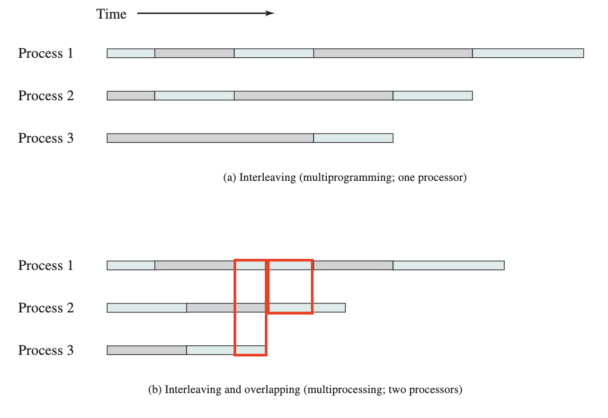
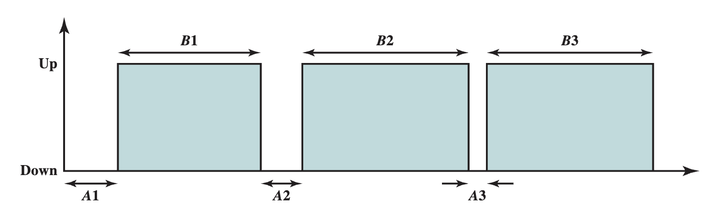
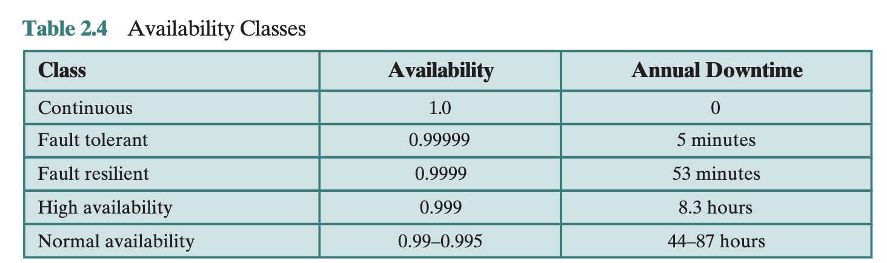

## 2.1 운영체제의 목적
- 운영체제란?
    - 응용 프로그램의 실행 제어 프로그램
    - 응용과 하드웨어 사이의 인터페이스
- 운영체제 목적 
    - 편의성, 효율성, 발전성
- 커널 (kernel)
    - main memory에 상주하는 운영체제의 핵심
        - 자주 사용하는 기능 포함
        - Nucleus

## 2.2 운영체제의 발전

1. 순차처리 
2. 단순일괄처리시스템
3. 멀티프로그래밍 일괄처리시스템
4. 시분할 시스템

## 2.3 주요 성과 

### 2.3.1 프로세스 관리
> **Process** 란?
> - A program in execution. 
> - An instance of a program running on a computer. 
> - The entity that can be assigned to and executed on a processor. 
> - A unit of activity characterized by a single sequential thread of execution, a current state, and an associated set of system resources. 

### 2.3.2 메모리 관리
> 메모리 관리를 위해 OS는 다음 5가지 핵심 기능을 지원해야 함
> - 프로세스 분리 
> - 자동할당 및 관리 
> - 모듈식 프로그래밍 지원
> - 보호 및 접근 제어 
> - 영구적 저장 지원

> **가상 메모리**
> - 프로그램들이 Main Memory 용량에 관계없이 논리적 관점에서 메모리 주소 지정을 할 수 있게 해주는 기법
> - 페이징 기법으로 관리한다. 

> **운영체제 오류 4가지**
> - Improper synchronization
> - Failed mutual exclusion
> - Nondeterminate program operation
> - Deadlocks

## 2.4 최근 운영체제로의 발전
> - Microkernel architecture 
> - Multithreading 
> - Symmetric multiprocessing 
> - Distributed operating systems 
> - Object-oriented design

### SMP ⭐️ (Symmetric multiprocessing)
> - 하나의 운영체제(OS)가 동일한 기능을 가진 CPU 여러 개를 동시에 제어·활용하는 구조
> - CPU를 여러 개 두고, 운영체제가 이를 대칭적으로 제어하는 구조

> 1. SMP의 장점
> - performance(성능): 여러 프로세스들이 서로 다른 처리기 상에서 동시에 실행될 수 있음 
> - **availability(가용성): 처리기 하나가 고장났더라도 시스템 전체가 망가지지는 않음**
> - incremental Growth
> - scaling: vendor들은 시스템에 장착된 처리기의 개수 조절해서 제품라인 다양하게 출시 가능 
>   - 메인보드의 물리적 크기가 정해져있기 때문에 cpu를 무한정 확장시키기엔 다소 무리가 있음


(a)는 overlaping 안되는데, (b)는 process overlaping 가능

## 2.5 Fault Tolerance (결함 허용)
> 하드웨어나 소프트웨어 고장에도 어떤 시스템 또는 컴포넌트가 계속 정상 작동할 수 있는 능력
> - 시스템의 신뢰성을 높이기 위해 고안
> - 여분의 설비(redundancy) 동반 

**Fault Tolerance 측정 단위**
1. Reliability
- t=0 에 정상작동하고 있던 시스템이 임의의 시간 t까지 계속 정상적으로 작동할 확률
2. MTTF(Mean Time To Failure)
3. MTTR(Mean Time to Repair)
4. Availability(A): 시스템이나 서비스가 기동된 이후 어느 시점까지의 총 시간 중 사용자의 요청을 서비스할 수 있던 시간이 얼마나 되는지 


```math
\text{MTTF} = \frac{B1 +B2+B3}{3}, 
\\ \text{MTTR} = \frac{A1 +A2+A3}{3}, 
\\ \text{A}= \frac{MTTF}{MTTF+MTTR}

```
- 가용성이 1(항상 가용)이 되는게 이상적인 것.



> **결함 유형**
> 1. Permanent 
>   - disk head crashes
>   - software bugs
>   - a burn-out communications component
> 2. Temporary

> **redundancy 유형**
> 1. Spatial (physical)
> 2. Temporal
> 3. Information

## 2.6 멀티프로세서와 멀티코어를 위한 운영체제 설계사항
