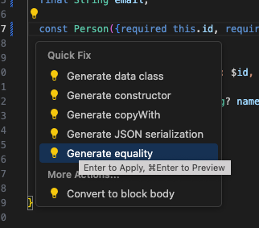

## object equality 비교 방법
> 일단, Object equality를 비교하기 전에 **Dart의 타입 시스템**, 특히 `final`과 `const`의 차이를 명확히 이해하는 것이 중요하다.  
> 나도 처음 Dart 문법 공부할 땐 대충 넘겼지만, **상태관리나 외부 API 데이터를 다룰수록 "타입이 얼마나 중요한지" 절감하게 됐다...ㅎ(뭐.. 하다보니 깨달을 수도 있는거죠..그냥 api 받아와서 보여주면 그만인 줄 알았어요)

#### 왜 중요한가???????????????????
- 외부에서 들어온 데이터를 `List`나 `State`로 관리할 때, 객체의 값은 같은데 `==` 비교가 `false`가 나오면?
- 불필요한 `setState()` 발생, 위젯 리빌드, 캐시 미스 등의 문제가 생긴다.
- 즉, 객체가 같다고 판단되게 하려면 단순히 `값`만 같아선 안 되고, **객체 비교 기준을 직접 정의**해야 한다.


## final과 const의 차이점 비교
| 구분                        | final          | const              |
| ------------------------- | -------------- | ------------------ |
| 선언 시점                     | 런타임에 결정됨       | 컴파일 타임에 결정됨        |
| 인스턴스 생성                   | 매번 새 객체        | 같은 값이면 재사용 (싱글턴처럼) |
| 메모리                       | 각각 따로 있음       | 공유됨 (정적 메모리로 할당됨)  |
| 동일성 (`==` 또는 `identical`) | 값이 같아도 `false` | 값이 같으면 `true`      |


> ### 다음과 같은 예제를 살펴보자
- 먼저 `Person` 객체를 정의한다.
- `Person` 클래스의 property는 `id`, `name`, `email`이다.

### person.dart
```dart
// ignore_for_file: public_member_api_docs, sort_constructors_first
class Person {
  final int id;
  final String name;
  final String email;

  Person({required this.id, required this.name, required this.email});

  @override
  String toString() => 'Person(id: $id, name: $name, email: $email)';

  Person copyWith({int? id, String? name, String? email}) {
    return Person(
      id: id ?? this.id,
      name: name ?? this.name,
      email: email ?? this.email,
    );
  }
}

```

### person_page.dart
```dart
import 'package:dart_class/models/person.dart';
import 'package:flutter/material.dart';

class PersonPage extends StatelessWidget {
  const PersonPage({super.key});

  @override
  Widget build(BuildContext context) {
    final person1 = Person(id: 1, name: 'John', email: 'john@gmail.com');
    final person2 = person1.copyWith(id: 2, email: 'Johndoe@gmail.com');
    final person3 = Person(id: 1, name: 'John', email: 'john@gmail.com');

    print(person1);
    print(person2);

    print(person1 == person3);
    print(person1.hashCode);
    print(person3.hashCode);

    return Scaffold(appBar: AppBar(title: Text('Person')));
  }
}
```

> 출력 결과: 
>false
>949309463
581349880
- 현재 person1과 person3의 property는 같은 상태이다. 하지만 equality 연산자의 값이 `false`임을 확인할 수 있다.
- dart의 기본 equality는 referential equality이다. 즉, 두 Object가 메모리상 같은 곳을 가르킬 때, equality -> true 라고 반환하게 된다. 


## 결론적으로, object의 프로퍼티가 같을 때 논리적 동등성을 가지기 위해서는 hash값을 override하던지, 아니면 처음부터 불변값으로 정해야한다.


### 1. Construct의 type을 const로 지정, const 인스턴스 사용
### person.dart
```dart
const Person({required this.id, required this.name, required this.email});
```

### person_page.dart
```dart
import 'package:dart_class/models/person.dart';
import 'package:flutter/material.dart';

class PersonPage extends StatelessWidget {
  const PersonPage({super.key});

  @override
  Widget build(BuildContext context) {
    const person1 = Person(id: 1, name: 'John', email: 'john@gmail.com');
    final person2 = person1.copyWith(id: 2, email: 'Johndoe@gmail.com');
    const person3 = Person(id: 1, name: 'John', email: 'john@gmail.com');

    print(person1);
    print(person2);

    print(person1 == person3);
    print(person1.hashCode);
    print(person3.hashCode);

    return Scaffold(appBar: AppBar(title: Text('Person')));
  }
}
```
### 출력결과
> true 423981177 // person 1 == person3의 논리적 equality


## 2. hash값 override

- `Generate equality`클릭 
```dart
// ignore_for_file: public_member_api_docs, sort_constructors_first
class Person {
  final int id;
  final String name;
  final String email;

  const Person({required this.id, required this.name, required this.email});

  @override
  String toString() => 'Person(id: $id, name: $name, email: $email)';

  Person copyWith({int? id, String? name, String? email}) {
    return Person(
      id: id ?? this.id,
      name: name ?? this.name,
      email: email ?? this.email,
    );
  }

  @override
  bool operator ==(covariant Person other) {
    if (identical(this, other)) return true;

    return other.id == id && other.name == name && other.email == email;
  }

  @override
  int get hashCode => id.hashCode ^ name.hashCode ^ email.hashCode;
}

```

## 3. equatable package 사용
- [pub.dev equatable 링크](https://pub.dev/packages/equatable)
### when? 
- object의 하나의 property가 같을 때, 같은 Object라고 간주하고 싶으면??
    - List<Object> get props => [$property_name];
```dart
import 'package:equatable/equatable.dart';

// ignore_for_file: public_member_api_docs, sort_constructors_first
class Person extends Equatable {
  final int id;
  final String name;
  final String email;

  const Person({required this.id, required this.name, required this.email});

  @override
  String toString() => 'Person(id: $id, name: $name, email: $email)';

  Person copyWith({int? id, String? name, String? email}) {
    return Person(
      id: id ?? this.id,
      name: name ?? this.name,
      email: email ?? this.email,
    );
  }

  @override
  List<Object> get props => [id, name, email]; 
}
```