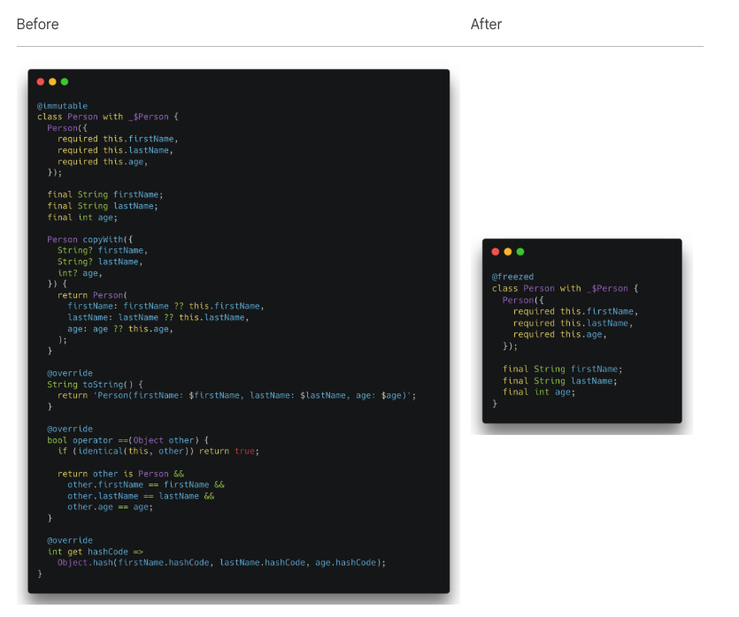
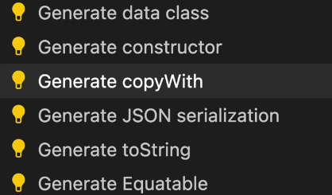

## 0. Introduction

> 데이터 모델을 관리 할 때, State를 불변으로 관리해야하는 상황을 종종 마주하게 된다. 
> - [Object equality](https://velog.io/@woojin-devv/flutter-%EC%83%81%ED%83%9C%EA%B4%80%EB%A6%AC%EC%97%90%EC%84%9C-%EB%86%93%EC%B9%98%EA%B8%B0-%EC%89%AC%EC%9A%B4-%EA%B0%9D%EC%B2%B4-%EB%8F%99%EB%93%B1%EC%84%B1) | equatable 패키지 사용
> - 객체의 인자 값들을 final로 정의하게 되면, 프로퍼티가 같아도 동일한 객체로 인지되지 않기때문에(`==` 연산자는 메모리 주소 기준으로 비교됨.) hashcode를 override해주는 과정이 필요한데, 데이터 모델이 복잡해질 수록 코드가 길어지고 귀찮아지는 일들이 많아진다고 한다. 
>> 
### 참고
> - Dart 3 전에는 freezed 패키지를 활용하여 data class를 생성하고 union/sealed class를 구현해야 했다. 그러나 Dart 3부터는 패턴 매칭(pattern matching)과 클래스 한정자(class modifiers)가 도입되어, 꼭 freezed에 의존하지 않아도 된다.


## 1. What is `freezed`?
> - define properties and a constructor
> - override toString, operator ==, hashCode
> - implement a `copyWith` method to clone the object
>> [dart dart class generator 스니펫으로도 가능]
>> 
>> 다만, 코드의 양도 많아지고, 완벽하게 구현되지는 않아서 코드 확인해야함.
> - handling `serialization/de-serialization`

## 2. When Should You Use `freezed`?
> - 데이터 클래스의 불변성 유지 및 실수로 값을 변경하는 것을 방지하고자 할 때
> - BLoC, Riverpod, Provider 같은 상태 관리 도구를 사용하여 복잡한 상태 전환을 관리할 때
> - 데이터 비교할 때 (단순 참조가 아닌 내용 깊이 기반의 비교가 필요할 때)
> - 하나의 데이터 모델이 여러 형태의 상태나 변형을 표현해야 할 때 (예: 로딩, 성공, 실패 상태)

## 3. `freezed` vs `json_serializable`: What’s the Difference?

## 4. install
```
flutter pub add freezed_annotation
flutter pub add --dev build_runner 
flutter pub add --dev freezed
```