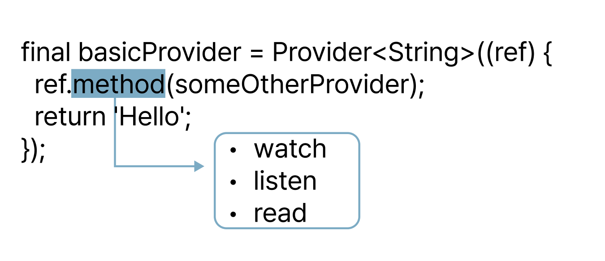

# ref의 method

> ### 1. watch
> - a widget reads the value of a provider and listens for changes in that value, and when that value changes, it **rebuild the widget** listening to that value.
> - If a provider watches another provider, it will **rebuild the listening provider** when the value of the provider it is watching changes.
> ---
>-  **[제약조건]**
>       - button's onPressed callback처럼 async한 상황에서 사용되어서는 안됨
>       - initState처럼 Widget의 lifecycle method에서 호출되어서는 안 됨
>       - ref.listenManual()의 존재
>           - listenManual()함수는 build function내에서 사용되어선 안됨
>           - initState와 같은 widget의 lifecycle에서 사용되도록 고안됨

> ### 2. listen 
> - watch + 알파라고 생각하면 되는데, rebuild 되는게 아니라 **perfom an action**
>   - displaying a dialog
>   - navigating to a new page.
> ---
>-  **[제약조건]**
>       - (watch랑 동일) |  button's onPressed callback처럼 async한 상황에서 사용되어서는 안됨
>       - (watch랑 동일) | initState처럼 Widget의 lifecycle method에서 호출되어서는 안 됨
>       - 위와 같은 상황에서 ref.method()를 사용해야한다면, ref.read()를 사용하는 방법이 있음.

> ### 3. read
> - **read**; read reads a value but **ignores changes**.
>   - value가 변화할 필요가 없는 button's callback에서 사용
> ---
>-  **[제약조건]**
>       - build function 내에서 사용하지 말것 
>       - Remi 왈: 찾기 힘든 버그 생성
